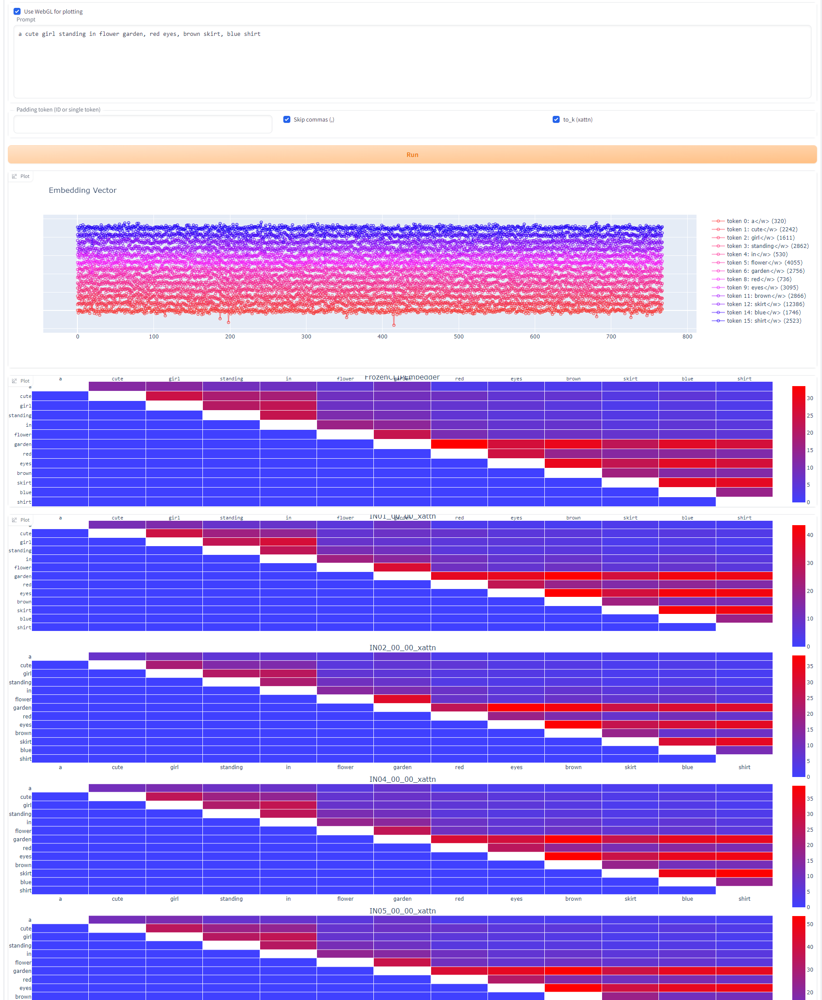
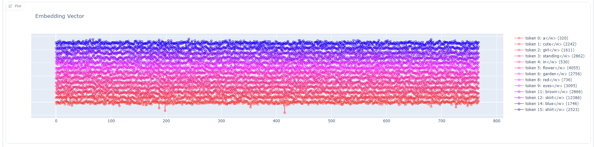
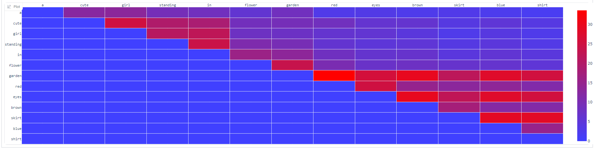

# EvViz2 - Embedding Vector Visualizer 2

## What is this?

This is an extension for [stable-diffusion-webui](https://github.com/AUTOMATIC1111/stable-diffusion-webui) which visualizes the embedding vector generated by CLIP.

## Example

## Usage

1. Input prompt as you like.
2. Click `Run` button.
3. Wait a second.

## Detail

### Embedding vectors (upper scatter)

This figure shows the embedding vector for each token. Each vector has 768 (for SDv1) or 1024 (for SDv2) dimensions.

### Correlations of each token (lower heatmap)

This figure shows correlations between each token. Calculation is carried out as follows:

1. Compute an embedding vector `v` from the given prompt. `v` is typically has dimension (77, 768).
2. For each token `t`, create a new prompt with the `t` replaced by *padding token*. Then compute its embedding vector `v_{t}`.
3. Let `d_{t} = v - v_{t}`.
4. Each row of `d_{t}` is a 768(or 1024)-dimensional vector representing `t`'s effect on each token. Then compute `|d_{t}|` for each row where `|x|` is norm of a vector `x`.
5. Repeat procedure 2..3 for all `t` in the given prompt.

In default, *padding token* is `!` (ID=0).